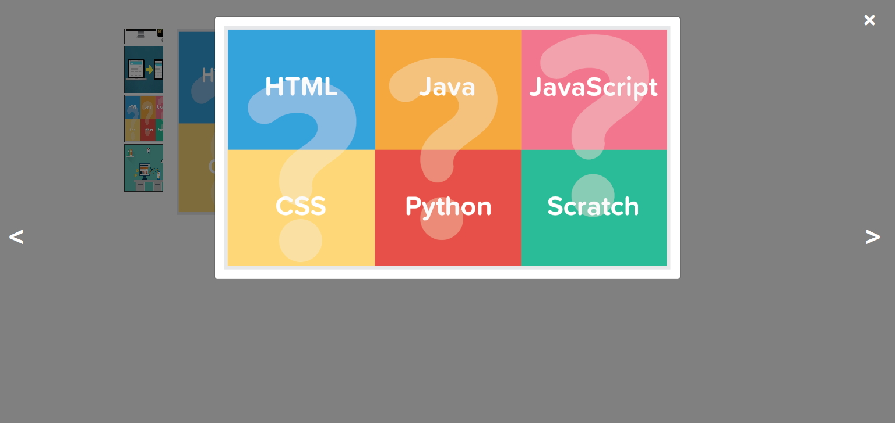

# Vertical Image Slider with lightbox modal popup

**If you like vertical_slider_with_lightbox_popup
, give it a ★ at the top right of this page.**

## Overview
Vertical slider with lightbox modal popup is image slider code that have vertical image sidebar and on each image click you can see image slider in modal popup. 
For clear information please check screenshots :)

## Requirements
- [x] Bootstrap
- [x] jQuery

## Installation
You can directly download files or can clone with git and run index.php file to see demo. If you want to change images then please go to img folder and replace images there.
```

### Screenshots of Slider
1. Vertical image slider (vertical_slider_demo1_shubham715.png)

2. Modal Popup


That's it.

## About Me
My name is Shubham and I'm a freelancer PHP and js developer and designer. I love coffee and play the games. **Hire me!**

🌎 Web: [https://thecoderain.blogspot.com](https://thecoderain.blogspot.com)

✉️ Email: [shubhamsharma715@gmail.com](mailto:shubhamsharma715@gmail.com)

